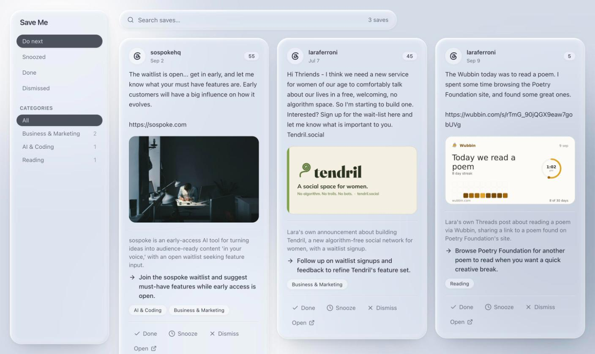

# Save Me

You save posts so you can come back to them: a recipe, a tool to try, a class that closes registration next week. Then they sit in five different "Saved" tabs and you forget about them.

Save Me pulls your saved posts from Threads, Instagram, Bluesky, X, and Reddit into one place on your own computer. It uses Claude to sort them into categories, write a one-line summary, and suggest a concrete next step for each ("Bake this overnight focaccia this weekend", "Install this CLI and try it on a side project"). The ones that are time-sensitive or most useful rise to the top.

Everything runs locally. There is no hosted service and no account to create.



<sub>The example saves are the author's own Threads posts. The summaries and next steps are real classifier output.</sub>

## What you get

- **One feed of every save**, laid out like Threads cards: post text, a large image, the author, and when it was posted.
- **A "Do next" queue** ranked by priority. Saves with a deadline in the next week or month move up, and ones whose deadline has passed sink.
- **A suggested action for each save**, plus a summary and up to three categories.
- **Done, Snooze, and Dismiss** to clear things out. Snoozed saves come back on their own.
- **Search** across post text, summaries, next steps, authors, and categories.
- **A browser extension** that syncs each platform with one click.

## How it works

```
 Your browser                        Your computer
 ┌──────────────────────────┐        ┌───────────────────────────────────────┐
 │ Save Me extension        │        │ Rails server (localhost:3080)         │
 │  reads the saved posts   │ ─────▶ │  stores saves in Postgres             │
 │  your saved page loads   │  POST  │  caches thumbnails                    │
 └──────────────────────────┘        │  background job ─▶ claude -p          │
                                     │    (category, summary, next step,     │
 ┌──────────────────────────┐        │     priority, deadline)               │
 │ Viewer (localhost:3081)  │ ◀───── │                                       │
 └──────────────────────────┘        └───────────────────────────────────────┘
```

1. **Capture.** Most of these platforms have no API for your saved posts. The extension opens your own Saved page in a small window, scrolls it, and reads the data the page itself loads. It never logs in for you, never sees your password, and never calls a platform API on its own.
2. **Store.** Each save goes to the local server with a shared token. Re-syncing updates a post's text and media but never touches your categories or what you've marked done.
3. **Classify.** A background job sends new saves to Claude in batches through the [Claude Code](https://docs.claude.com/en/docs/claude-code) CLI (`claude -p`). That runs on your own Claude plan, with no API key to manage.
4. **Browse.** The viewer reads from the same local server.

### Supported platforms

| Platform  | Where the extension reads from     | Notes |
|-----------|------------------------------------|-------|
| Threads   | `threads.com/saved`                | Multi-part posts ("1/3") come in as their first part. |
| Instagram | `instagram.com/<you>/saved/all-posts/` | Needs your username in the extension's settings. Reels, carousels, and saved ads all come through. |
| Bluesky   | `bsky.app/saved`                   | Uses Bluesky's official bookmarks endpoint. The only platform that records *when* you saved something. |
| X         | `x.com/i/bookmarks`                | Photos, video, and long posts. |
| Reddit    | `old.reddit.com/saved`             | Saved posts and comments. Uses old Reddit, whose pages are simpler and more stable than the new site's. |

Pinterest is not supported yet.

## Requirements

- macOS or Linux
- **Ruby 3.3** and **PostgreSQL**
- **Node 24** (the frontend's test runner doesn't start on Node 20)
- **Google Chrome**, or another Chromium browser that can load unpacked extensions
- **[Claude Code](https://docs.claude.com/en/docs/claude-code)** installed and logged in. Run `claude` once in a terminal to sign in.

## Setup

### 1. Server

```bash
git clone https://github.com/ferronis/save-me.git
cd save-me

cp .env.example .env
# Generate a random INGEST_TOKEN and write it into .env:
sed -i.bak "s/^INGEST_TOKEN=.*/INGEST_TOKEN=$(ruby -rsecurerandom -e 'puts SecureRandom.hex(32)')/" .env && rm .env.bak
grep INGEST_TOKEN .env   # you'll paste this value into the extension later
# Optionally set CLASSIFIER_INTERESTS in .env (see Configuration below).

bundle install
bin/rails db:prepare
bin/rails server        # http://localhost:3080
```

The background worker runs inside the Rails server, so this is the only process you need for syncing and classifying.

### 2. Viewer

```bash
cd frontend
nvm use                 # switches to Node 24 from .nvmrc
npm install
npm run dev             # http://localhost:3081
```

### 3. Extension

1. Open `chrome://extensions` and turn on **Developer mode** (top right).
2. Click **Load unpacked** and choose the `extension/` folder.
3. Open any normal web page and click the Save Me toolbar icon. A panel slides in on the right. It can't open on Chrome's own pages, such as the new tab page.
4. Click the gear and paste the `INGEST_TOKEN` value from your `.env`. If you use Instagram, add your username too.

### 4. First sync

In the panel, click **Sync** next to a platform. A small window opens on your Saved page and scrolls through it. Keep that window visible until it closes on its own. These sites stop loading more posts in a hidden or minimized window.

The first sync pulls everything. Later syncs stop as soon as they reach posts they already have. If a sync is interrupted, the next one goes all the way through again. Browsing your saved pages normally also picks up whatever they load.

New saves are classified in the background, about 25 seconds per 20 saves, three batches at a time. A large first sync can take a few minutes to classify. To work through a backlog in the foreground instead, run `bin/rails saves:classify`.

## Configuration

All settings live in `.env`.

| Variable               | Default | What it does |
|------------------------|---------|--------------|
| `INGEST_TOKEN`         | *(required)* | Shared secret the extension sends with every sync. Requests without it are rejected. |
| `CLASSIFIER_INTERESTS` | *(empty)* | What you care about, in plain words, e.g. `pottery, sourdough, and home robotics`. Saves that match rank higher. Leave it empty to rank on general usefulness. |
| `CLASSIFIER_MODEL`     | `sonnet` | Model alias passed to `claude -p`. |
| `CLASSIFIER_EFFORT`    | `low`   | Effort level passed to `claude -p`. Higher effort is about twice as slow and noticeably better only rarely. |
| `SOLID_QUEUE_IN_PUMA`  | `true`  | Runs the background worker inside the Rails server. |

**Running the server somewhere other than `localhost:3080`:** the extension is only allowed to talk to `http://localhost:3080`. Add your server's origin to `host_permissions` in `extension/manifest.json`, reload the extension in `chrome://extensions`, then set the new address under Server in the panel's settings.

## Privacy

- Your saves, their images, and their classifications are stored only in your local Postgres database and `storage/` folder.
- To classify a save, Save Me sends its text, author, posted date, link, and image descriptions to Claude through your Claude Code CLI. Anthropic's terms for your Claude plan apply to that data. Images themselves are not sent.
- The extension's capture scripts run only on the five supported sites, and only read what your saved pages load. Its panel appears on whatever page you open it on, and only when you click the toolbar icon. Nothing runs in the background except during a sync.
- The viewer's API has no login, because it's meant to be reachable only from your own machine. Don't expose port 3080 or 3081 to a network you don't trust.

## A note on platform terms

The extension reads the same data your browser already loads when you look at your own saved posts. It doesn't log in for you, bypass access controls, or call these platforms' APIs on its own. Even so, automated collection from these sites sits in a gray area of their terms of service. Use it for your own saves, at a gentle pace, and at your own risk.

## Development

```
app/                 Rails API: ingest, saves, classifier, background jobs
extension/           Chrome extension (Manifest V3, no build step)
  hook.js              runs in the page and forwards the responses that carry saves
  relay.js             bridges to the service worker and drives scrolling during a sync
  background.js        maps responses to saves and posts them to the server
  panel.js             the in-page sync panel
  threads.js, instagram.js, bluesky.js, x.js, reddit.js   per-platform parsers
frontend/            React 19 + Vite + Tailwind 4 viewer
```

Run the tests:

```bash
bin/rails test
(cd frontend && npm test)
(cd extension && npm test)
```

CI also runs RuboCop, Brakeman, bundler-audit, and the frontend linter. `CLAUDE.md` has deeper notes on how each part works and why, written for AI coding agents but useful for anyone.

Adding a platform usually means three things: a rule in `hook.js` for which responses carry saves, a parser like `bluesky.js`, and a sync URL in `background.js`.

## Troubleshooting

- **A sync window sits on the same posts.** Make sure it isn't minimized or covered by another full-screen app. Threads in particular can take 10 seconds or more to load the next page. The window gives up after about 30 seconds with nothing new.
- **"Token rejected. Check settings."** The token in the extension doesn't match `INGEST_TOKEN` in `.env`. Restart the server after editing `.env`.
- **"Can't reach the server."** Start the Rails server with `bin/rails server`.
- **Saves arrive but never get categories.** Check that `claude -p "hi"` works in a terminal. Classification errors show up in `log/development.log`.
- **The toolbar icon does nothing.** You're on a Chrome page like the new tab page, where extensions can't draw. Switch to any website.

## License

[MIT](LICENSE).

Platform names and logos belong to their owners and are used only to identify where each save came from. Logos are from [Simple Icons](https://simpleicons.org) (CC0).
